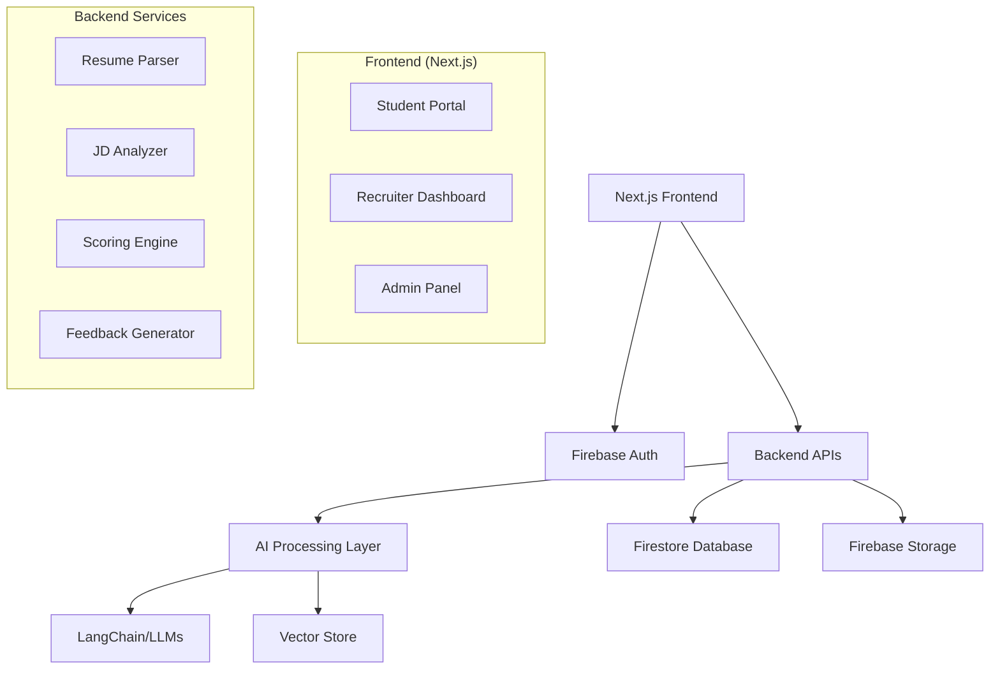

# Product Requirements Document (PRD): Theme 2 - Automated Resume Relevance Check System

## 📋 Table of Contents
1. [Objective](#objective)
2. [Key Features and Functional Requirements](#key-features-and-functional-requirements)
3. [Technology Stack](#technology-stack)
4. [Architecture Overview](#architecture-overview)
5. [Workflow](#workflow)
6. [Database Schema (Firestore)](#database-schema-firestore)
7. [Authentication (Firebase Auth)](#authentication-firebase-auth)
8. [API Endpoints](#api-endpoints)
9. [Frontend Implementation (Next.js)](#frontend-implementation-nextjs)
10. [Hackathon Timeline & Deliverables](#hackathon-timeline--deliverables)
11. [Technical Implementation Details](#technical-implementation-details)
12. [Security & Compliance](#security--compliance)
13. [Scalability Considerations](#scalability-considerations)
14. [Acceptance Criteria](#acceptance-criteria)

---

## 1. Objective

**Main Takeaway:** Develop an AI-powered system to automate, scale, and improve the consistency and feedback of resume evaluation against job descriptions for large volumes of applicants. The backend remains unchanged, while the new frontend will be implemented using Next.js (React TypeScript).

**Goals:**
- Build a robust web application for placement teams to automate resume screening
- Generate relevance scores (0-100) for resumes against job descriptions
- Highlight gaps (skills, projects, certifications)
- Provide personalized improvement feedback
- Store all evaluations on an accessible dashboard for recruiters
- Scale to thousands of resumes weekly
- Ensure consistency and accelerate shortlisting for fast-paced hiring needs

---

## 2. Key Features and Functional Requirements

### 2.1 Resume & Job Description Upload
- **Student Portal:** Upload resumes in PDF/DOCX format via web interface
- **Placement Team Portal:** Upload job descriptions (JD)
- **File Validation:** Support for multiple file formats with size limits
- **Batch Upload:** Support for multiple resume uploads

### 2.2 Parsing and Standardization
- **Resume Text Extraction:** PyMuPDF/pdfplumber (PDF), python-docx/docx2txt (DOCX)
- **JD Parsing:** Extract role title, must-have & good-to-have skills, qualifications
- **Normalization:** Remove headers/footers, apply standard formatting
- **Section Identification:** Contact info, education, experience, skills, projects

### 2.3 Scoring and Analysis
- **Hard Match:** Keyword, skills, education matching using TF-IDF, BM25
- **Semantic Match:** Embedding-based similarity using LLMs (GPT/Gemini/Claude)
- **Weighted Scoring:** Combines hard and soft match for final relevance score
- **Verdict Generation:** High (80-100), Medium (50-79), Low (0-49) suitability
- **Gap Analysis:** Missing skills/projects/certifications highlighted
- **Improvement Suggestions:** Personalized feedback generated by LLM

### 2.4 Dashboard & Search/Filter
- **Placement Team Dashboard:** Upload JD, view shortlisted candidates
- **Advanced Filtering:** By job role, score range, location, experience level
- **Search Functionality:** Full-text search across resumes
- **Export Features:** Download shortlisted resumes, generate reports

### 2.5 Student Feedback System
- **Real-time Feedback:** Immediate response on resume submission
- **Personalized Suggestions:** AI-generated improvement recommendations
- **Score Breakdown:** Detailed analysis of strengths and weaknesses
- **Resubmission:** Allow students to upload improved resumes

### 2.6 Web Application (Frontend - Next.js)
- **Framework:** Next.js with React TypeScript
- **Responsive Design:** Accessible on all modern devices
- **Multi-role Authentication:** Student and recruiter portals
- **Real-time Updates:** Live status of resume processing
- **Interactive Dashboard:** Drag-and-drop uploads, filtering, sorting

### 2.7 Backend Integration
- **API Communication:** REST API endpoints for all operations
- **Unchanged Backend:** Existing Flask/FastAPI backend remains as-is
- **Real-time Processing:** WebSocket connections for live updates

---

## 3. Technology Stack

| Layer | Technology | Description |
|-------|------------|-------------|
| **Frontend** | Next.js 14, React 18, TypeScript | New implementation per hackathon guidelines |
| **Backend** | Flask/FastAPI, Python | Resume/JD parsing, scoring, feedback generation |
| **AI Layer** | LangChain, LLMs, Chroma/FAISS/Pinecone | Semantic analysis, scoring, feedback |
| **Database** | **Firestore (NoSQL)** | Stores resume data, scores, logs, user profiles |
| **Authentication** | **Firebase Auth** | Multi-role authentication system |
| **Storage** | Firebase Storage | File storage for resumes and JDs |
| **Deployment** | Vercel (Frontend), Google Cloud Run (Backend) | Scalable cloud deployment |

---

## 4. Architecture Overview



---

## 5. Workflow

### 5.1 Complete Application Flow

1. **User Authentication**
   - Firebase Auth handles login/registration
   - Role-based access (Student/Recruiter/Admin)

2. **Job Description Upload**
   - Placement team uploads JD via dashboard
   - JD parsed and stored in Firestore
   - Skills and requirements extracted

3. **Resume Submission**
   - Students upload PDF/DOCX resume
   - File stored in Firebase Storage
   - Processing queue initiated

4. **Parsing & Analysis**
   - Text extraction and standardization
   - Hard match: skills/keywords analysis
   - Semantic match: embedding similarity
   - Final score calculation and verdict

5. **Feedback & Storage**
   - Score, verdict, and suggestions generated
   - All data stored in Firestore
   - Real-time updates to dashboard

6. **Recruiter Dashboard**
   - Filter/sort resumes by criteria
   - Download shortlists
   - Review detailed feedback

---

## 6. Database Schema (Firestore)

### 6.1 Collections Structure

#### Users Collection
```javascript
users/{userId} {
  uid: string,
  email: string,
  role: 'student' | 'recruiter' | 'admin',
  profile: {
    name: string,
    phone?: string,
    organization?: string,
    department?: string
  },
  createdAt: timestamp,
  updatedAt: timestamp,
  isActive: boolean
}
```

#### Job Descriptions Collection
```javascript
jobDescriptions/{jdId} {
  id: string,
  title: string,
  company: string,
  description: string,
  requirements: {
    mustHave: string[],
    goodToHave: string[],
    experience: string,
    education: string[]
  },
  uploadedBy: string, // recruiter userId
  createdAt: timestamp,
  isActive: boolean,
  applicationCount: number
}
```

#### Resumes Collection
```javascript
resumes/{resumeId} {
  id: string,
  studentId: string,
  jobDescriptionId: string,
  fileName: string,
  fileUrl: string, // Firebase Storage URL
  extractedText: string,
  parsedData: {
    personalInfo: {
      name: string,
      email: string,
      phone: string,
      location: string
    },
    education: Array<{
      degree: string,
      institution: string,
      year: string,
      gpa?: string
    }>,
    experience: Array<{
      title: string,
      company: string,
      duration: string,
      description: string
    }>,
    skills: string[],
    projects: Array<{
      name: string,
      description: string,
      technologies: string[]
    }>,
    certifications: string[]
  },
  analysis: {
    relevanceScore: number, // 0-100
    verdict: 'High' | 'Medium' | 'Low',
    hardMatchScore: number,
    semanticMatchScore: number,
    matchedSkills: string[],
    missingSkills: string[],
    strengths: string[],
    gaps: string[]
  },
  feedback: {
    overallFeedback: string,
    improvementSuggestions: string[],
    recommendedSkills: string[],
    recommendedProjects: string[]
  },
  status: 'processing' | 'completed' | 'failed',
  createdAt: timestamp,
  processedAt?: timestamp
}
```

#### Analytics Collection
```javascript
analytics/{date} {
  date: string, // YYYY-MM-DD
  totalResumes: number,
  processedResumes: number,
  averageScore: number,
  scoreDistribution: {
    high: number,
    medium: number,
    low: number
  },
  topSkills: Array<{skill: string, count: number}>,
  processingTime: {
    average: number,
    min: number,
    max: number
  }
}
```

### 6.2 Firestore Security Rules
```javascript
rules_version = '2';
service cloud.firestore {
  match /databases/{database}/documents {
    // Users can read/write their own data
    match /users/{userId} {
      allow read, write: if request.auth != null && request.auth.uid == userId;
    }
    
    // Only recruiters can create/read job descriptions
    match /jobDescriptions/{jdId} {
      allow read, write: if request.auth != null && 
        get(/databases/$(database)/documents/users/$(request.auth.uid)).data.role == 'recruiter';
    }
    
    // Students can create resumes, recruiters can read them
    match /resumes/{resumeId} {
      allow create: if request.auth != null;
      allow read: if request.auth != null && 
        (resource.data.studentId == request.auth.uid || 
         get(/databases/$(database)/documents/users/$(request.auth.uid)).data.role == 'recruiter');
      allow update: if request.auth != null && 
        get(/databases/$(database)/documents/users/$(request.auth.uid)).data.role == 'recruiter';
    }
    
    // Analytics readable by recruiters and admins
    match /analytics/{document} {
      allow read: if request.auth != null && 
        get(/databases/$(database)/documents/users/$(request.auth.uid)).data.role in ['recruiter', 'admin'];
    }
  }
}
```

---

## 7. Authentication (Firebase Auth)

### 7.1 Authentication Setup
```typescript
// firebase/config.ts
import { initializeApp } from 'firebase/app';
import { getAuth } from 'firebase/auth';
import { getFirestore } from 'firebase/firestore';
import { getStorage } from 'firebase/storage';

const firebaseConfig = {
  apiKey: process.env.NEXT_PUBLIC_FIREBASE_API_KEY,
  authDomain: process.env.NEXT_PUBLIC_FIREBASE_AUTH_DOMAIN,
  projectId: process.env.NEXT_PUBLIC_FIREBASE_PROJECT_ID,
  storageBucket: process.env.NEXT_PUBLIC_FIREBASE_STORAGE_BUCKET,
  messagingSenderId: process.env.NEXT_PUBLIC_FIREBASE_MESSAGING_SENDER_ID,
  appId: process.env.NEXT_PUBLIC_FIREBASE_APP_ID
};

const app = initializeApp(firebaseConfig);
export const auth = getAuth(app);
export const db = getFirestore(app);
export const storage = getStorage(app);
```

### 7.2 Authentication Methods
- **Email/Password:** Primary authentication method
- **Google OAuth:** Social login option
- **Role-based Access:** Student, Recruiter, Admin roles
- **Email Verification:** Required for account activation
- **Password Reset:** Secure password recovery

### 7.3 User Management
```typescript
// types/user.ts
export interface User {
  uid: string;
  email: string;
  role: 'student' | 'recruiter' | 'admin';
  profile: {
    name: string;
    phone?: string;
    organization?: string;
    department?: string;
  };
  createdAt: Date;
  updatedAt: Date;
  isActive: boolean;
}

// hooks/useAuth.ts
export const useAuth = () => {
  const [user, setUser] = useState<User | null>(null);
  const [loading, setLoading] = useState(true);
  
  // Authentication logic
};
```

---

## 8. API Endpoints

### 8.1 Authentication Endpoints
```typescript
// Authentication handled by Firebase Auth SDK
// Custom claims for roles managed via Firebase Admin SDK
```

### 8.2 Resume Processing Endpoints
```typescript
POST /api/resumes/upload
// Upload and process resume
Body: { file: File, jobDescriptionId: string }
Response: { resumeId: string, status: 'processing' }

GET /api/resumes/{resumeId}
// Get resume analysis results
Response: { resume: Resume, analysis: Analysis, feedback: Feedback }

GET /api/resumes/student/{studentId}
// Get all resumes for a student
Response: { resumes: Resume[] }
```

### 8.3 Job Description Endpoints
```typescript
POST /api/job-descriptions
// Create new job description
Body: { title: string, company: string, description: string, requirements: Requirements }
Response: { jobDescriptionId: string }

GET /api/job-descriptions
// Get all active job descriptions
Response: { jobDescriptions: JobDescription[] }

GET /api/job-descriptions/{jdId}/applications
// Get all applications for a job
Response: { applications: Resume[] }
```

### 8.4 Dashboard Endpoints
```typescript
GET /api/dashboard/analytics
// Get dashboard analytics
Response: { totalResumes: number, averageScore: number, distribution: ScoreDistribution }

GET /api/dashboard/resumes/filter
// Filter resumes with criteria
Query: { jobId?, minScore?, maxScore?, verdict?, limit?, offset? }
Response: { resumes: Resume[], total: number }
```

---

## 9. Frontend Implementation (Next.js)

### 9.1 Project Structure
```
src/
├── app/
│   ├── (auth)/
│   │   ├── login/
│   │   └── register/
│   ├── (dashboard)/
│   │   ├── student/
│   │   ├── recruiter/
│   │   └── admin/
│   ├── api/
│   └── globals.css
├── components/
│   ├── ui/
│   ├── forms/
│   ├── dashboard/
│   └── shared/
├── hooks/
├── lib/
├── types/
└── utils/
```

### 9.2 Key Components

#### Student Dashboard
```typescript
// components/dashboard/StudentDashboard.tsx
export const StudentDashboard = () => {
  return (
    <div className="grid grid-cols-1 md:grid-cols-2 lg:grid-cols-3 gap-6">
      <ResumeUploadCard />
      <ApplicationStatusCard />
      <FeedbackCard />
      <ScoreHistoryChart />
    </div>
  );
};
```

#### Recruiter Dashboard
```typescript
// components/dashboard/RecruiterDashboard.tsx
export const RecruiterDashboard = () => {
  return (
    <div className="space-y-6">
      <DashboardHeader />
      <FilterPanel />
      <ResumeTable />
      <AnalyticsPanel />
    </div>
  );
};
```

#### Resume Upload Component
```typescript
// components/forms/ResumeUpload.tsx
export const ResumeUpload = () => {
  const [file, setFile] = useState<File | null>(null);
  const [jobId, setJobId] = useState<string>('');
  const [uploading, setUploading] = useState(false);

  const handleUpload = async () => {
    // Upload logic with progress tracking
  };

  return (
    <Card>
      <CardHeader>
        <CardTitle>Upload Resume</CardTitle>
      </CardHeader>
      <CardContent>
        <FileDropzone onFileSelect={setFile} />
        <JobSelector onJobSelect={setJobId} />
        <Button onClick={handleUpload} disabled={uploading}>
          {uploading ? 'Processing...' : 'Upload Resume'}
        </Button>
      </CardContent>
    </Card>
  );
};
```

### 9.3 State Management
```typescript
// Using Zustand for state management
import { create } from 'zustand';

interface AppState {
  user: User | null;
  resumes: Resume[];
  jobDescriptions: JobDescription[];
  filters: FilterState;
  setUser: (user: User | null) => void;
  addResume: (resume: Resume) => void;
  updateFilters: (filters: Partial<FilterState>) => void;
}

export const useAppStore = create<AppState>((set) => ({
  user: null,
  resumes: [],
  jobDescriptions: [],
  filters: {},
  setUser: (user) => set({ user }),
  addResume: (resume) => set((state) => ({ 
    resumes: [...state.resumes, resume] 
  })),
  updateFilters: (filters) => set((state) => ({ 
    filters: { ...state.filters, ...filters } 
  })),
}));
```

---

## 10. Hackathon Timeline & Deliverables

### 10.1 Strict Timeline
- **Challenge Start:** 20 Sep, 2025, 11:00 AM IST
- **Final Submission Deadline:** 21 Sep, 2025, 2:00 PM IST (No extensions)
- **Web Application Accessibility:** Must work until 25 Sep, 2025

### 10.2 Submission Checklist
✅ **Theme Selection:** Theme 2 - GenAI Automated Resume Relevance Check System

✅ **Required Deliverables:**
1. **GitHub Repository**
   - Complete source code
   - README with problem statement, approach, installation, usage
   - Clear documentation

2. **YouTube Video**
   - 15-30 minute walkthrough
   - Public accessible
   - Demo of all features

3. **Web Application Link**
   - Public deployment (Vercel/Netlify for frontend)
   - Working demo accessible to judges

### 10.3 Development Timeline
```
Day 1 (20 Sep):
├── 11:00 AM - Project Setup & Authentication
├── 02:00 PM - Database Schema & Firebase Setup
├── 05:00 PM - Basic Frontend Components
└── 08:00 PM - Resume Upload Functionality

Day 2 (21 Sep):
├── 08:00 AM - Dashboard Implementation
├── 11:00 AM - Integration Testing
├── 01:00 PM - Final Deployment & Video
└── 02:00 PM - SUBMISSION DEADLINE
```

---

## 11. Technical Implementation Details

### 11.1 Backend (Unchanged)
- **Resume Parsing:** PyMuPDF/pdfplumber (PDF), python-docx/docx2txt (DOCX)
- **Text Processing:** spaCy/NLTK for standardization
- **AI Orchestration:** LangChain/LangGraph/LangSmith
- **Vector Storage:** Chroma/FAISS/Pinecone for embeddings
- **LLM Integration:** GPT/Gemini/Claude/HuggingFace models
- **Scoring Algorithm:** Hybrid weighted mechanism

### 11.2 Frontend (New Implementation)
```typescript
// Key Technologies
- Next.js 14 with App Router
- React 18 with TypeScript
- Tailwind CSS for styling
- Shadcn/ui for components
- React Hook Form for form handling
- Tanstack Query for data fetching
- Framer Motion for animations
```

### 11.3 Real-time Features
```typescript
// Real-time updates using Firebase Firestore listeners
import { onSnapshot } from 'firebase/firestore';

export const useRealtimeResumes = (jobId: string) => {
  const [resumes, setResumes] = useState<Resume[]>([]);
  
  useEffect(() => {
    const unsubscribe = onSnapshot(
      query(
        collection(db, 'resumes'),
        where('jobDescriptionId', '==', jobId)
      ),
      (snapshot) => {
        const updatedResumes = snapshot.docs.map(doc => ({
          id: doc.id,
          ...doc.data()
        }));
        setResumes(updatedResumes);
      }
    );
    
    return unsubscribe;
  }, [jobId]);
  
  return resumes;
};
```

---

## 12. Security & Compliance

### 12.1 Authentication Security
- **Firebase Auth:** Industry-standard authentication
- **JWT Tokens:** Secure token-based authentication
- **Role-based Access:** Granular permission system
- **Session Management:** Automatic token refresh

### 12.2 Data Security
- **Firestore Security Rules:** Database-level security
- **File Upload Validation:** Secure file handling
- **Input Sanitization:** XSS and injection prevention
- **HTTPS Enforcement:** All communications encrypted

### 12.3 Privacy Compliance
- **Data Minimization:** Only collect necessary data
- **User Consent:** Clear privacy policy
- **Data Retention:** Automatic cleanup policies
- **GDPR/FERPA Compliance:** If storing PII

### 12.4 Security Implementation
```typescript
// Input validation middleware
export const validateResumeUpload = (req: Request, res: Response, next: NextFunction) => {
  const allowedTypes = ['application/pdf', 'application/vnd.openxmlformats-officedocument.wordprocessingml.document'];
  const maxSize = 10 * 1024 * 1024; // 10MB
  
  if (!allowedTypes.includes(req.file?.mimetype)) {
    return res.status(400).json({ error: 'Invalid file type' });
  }
  
  if (req.file?.size > maxSize) {
    return res.status(400).json({ error: 'File too large' });
  }
  
  next();
};
```

---

## 13. Scalability Considerations

### 13.1 Database Scaling
- **Firestore Auto-scaling:** Handles thousands of concurrent operations
- **Indexing Strategy:** Optimized queries for filtering and search
- **Data Partitioning:** Organize data by date/organization
- **Caching Layer:** Redis for frequently accessed data

### 13.2 Processing Scaling
- **Queue System:** Background job processing
- **Load Balancing:** Multiple backend instances
- **CDN Integration:** Fast file delivery
- **Monitoring:** Performance tracking and alerts

### 13.3 Performance Optimization
```typescript
// Firestore query optimization
export const getFilteredResumes = async (filters: FilterOptions) => {
  let query = collection(db, 'resumes');
  
  if (filters.jobId) {
    query = query(where('jobDescriptionId', '==', filters.jobId));
  }
  
  if (filters.minScore) {
    query = query(where('analysis.relevanceScore', '>=', filters.minScore));
  }
  
  // Add pagination
  query = query(orderBy('createdAt', 'desc'), limit(20));
  
  return getDocs(query);
};
```

---

## 14. Acceptance Criteria

### 14.1 Technical Requirements
✅ **Frontend:** Next.js with React TypeScript implementation
✅ **Database:** Firestore integration with proper schema
✅ **Authentication:** Firebase Auth with role-based access
✅ **File Upload:** PDF/DOCX resume upload functionality
✅ **AI Processing:** Resume analysis and scoring system
✅ **Dashboard:** Functional recruiter workflow interface
✅ **Feedback System:** Student feedback and suggestions
✅ **Real-time Updates:** Live status and notifications

### 14.2 Functional Requirements
✅ **Multi-role Login:** Student and recruiter portals
✅ **Resume Processing:** Automated parsing and analysis
✅ **Scoring System:** 0-100 relevance scoring
✅ **Gap Analysis:** Missing skills identification
✅ **Search/Filter:** Advanced filtering capabilities
✅ **Export Features:** Download shortlists and reports
✅ **Responsive Design:** Mobile and desktop compatibility

### 14.3 Submission Requirements
✅ **GitHub Repository:** Complete codebase with documentation
✅ **YouTube Video:** 15-30 minute walkthrough
✅ **Deployed Application:** Public accessible web app
✅ **Timeline Compliance:** Submitted by 21 Sep, 2:00 PM IST
✅ **Documentation:** Clear README and technical docs

### 14.4 Quality Standards
✅ **Code Quality:** Clean, maintainable TypeScript code
✅ **Error Handling:** Comprehensive error management
✅ **Testing:** Unit and integration tests
✅ **Performance:** Fast loading and responsive UI
✅ **Security:** Secure authentication and data handling
✅ **Accessibility:** WCAG compliance for inclusive design

---

## 🚀 Getting Started

### Prerequisites
- Node.js 18+
- Firebase Project Setup
- Backend API running

### Installation
```bash
# Clone repository
git clone <repository-url>
cd resume-relevance-system

# Install dependencies
npm install

# Setup environment variables
cp .env.example .env.local
# Add Firebase configuration

# Run development server
npm run dev
```

### Environment Variables
```env
NEXT_PUBLIC_FIREBASE_API_KEY=
NEXT_PUBLIC_FIREBASE_AUTH_DOMAIN=
NEXT_PUBLIC_FIREBASE_PROJECT_ID=
NEXT_PUBLIC_FIREBASE_STORAGE_BUCKET=
NEXT_PUBLIC_FIREBASE_MESSAGING_SENDER_ID=
NEXT_PUBLIC_FIREBASE_APP_ID=
NEXT_PUBLIC_BACKEND_API_URL=
```

---

## 📞 Support & Resources

- **Discord Channel:** Real-time mentoring during hackathon
- **Documentation:** Comprehensive technical guides
- **API Reference:** Backend endpoint documentation
- **Troubleshooting:** Common issues and solutions

---

**Note:** This PRD strictly adheres to all hackathon rules, deadlines, and technical requirements. Any deviation may lead to disqualification. The system is designed to be feasible within the hackathon timeline while maintaining high quality and functionality standards.
